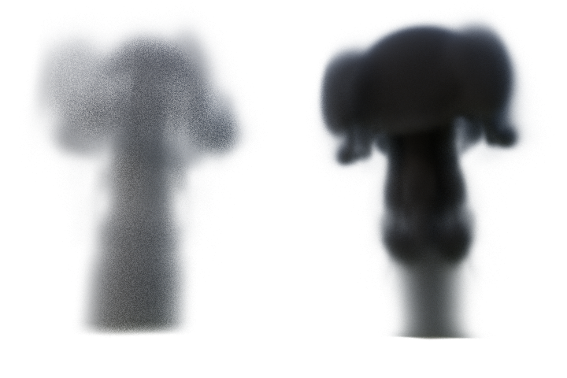

# Wavelet turbulence

  

This project is a python implementation of the paper [Wavelet Turbulence for Fluid Simulation](https://www.cs.cornell.edu/~tedkim/WTURB/wavelet_turbulence.pdf) from Theodore Kim, Doug James, Nils Thurey, and Markus Gross.   
It's the result of a school project in our Wavelet course, where we had to implement a paper that use wavelets.   
We did not implement everything the wavelet noise for example because it's an other paper.   
To see our results we rendered a [short video](https://youtu.be/3StmTPVowXk) 

## Requirements
### OpenVDB
Refer to instructions found there : https://pypi.org/project/pyopenvdb/ (it is not only pip install pyopenvdb)

### numpy
`pip install numpy`

### pywt
`pip install pyWavelets`

## Start the project

`./smoke.py`
(will transform fluid_data_0190.vdb to make it 3times its base resolution)

You can view the files in blender for example (drag & drop the file in blender).

## Bugs
 - Pyopenvdb seems to not yet support all .vdb files. It is however able to open the ones created by blender, like for example fluid_data_0190.vdb.

## Files
 - Archive : contains programs that we wrote but we do not use now
    - `fluidSim.py` and `smokeSim.py` are implementations of Jos Stam's paper
    - `test_vdb_format.py` is a test file for the VDB format
 - render : contains render images and files
 - simulation : contains folders with VDB sequences
 - `createFluid.py` is a program that read a vdb file and store it in a class
 - `fluid_data_0190.vdb` is a low-res simulation created by Blender
 - `render.vdb` is a final vdb file after launching the program on `fluid_data_0190.vdb`
 - `interpolate.py`, `noise.py`and `smoke.py` are program files
 - `noiseTile` is a noise tile (thanks captain obvious) generated using the author's implementation. However, its size limits us to upgrade simulations to a resolution up to 128x128x128. We took this size because it is enough for the purpose of this project, and is already long enough to compute.

## References
 - [Original paper](https://www.cs.cornell.edu/~tedkim/WTURB/)
 - [Real-Time Fluid Dynamics for Games (Jos Stam)](https://www.dgp.toronto.edu/public_user/stam/reality/Research/pdf/GDC03.pdf)
 - [Wavelet noise (COOK, R.,ANDDEROSE, T.)](https://graphics.pixar.com/library/WaveletNoise/paper.pdf)